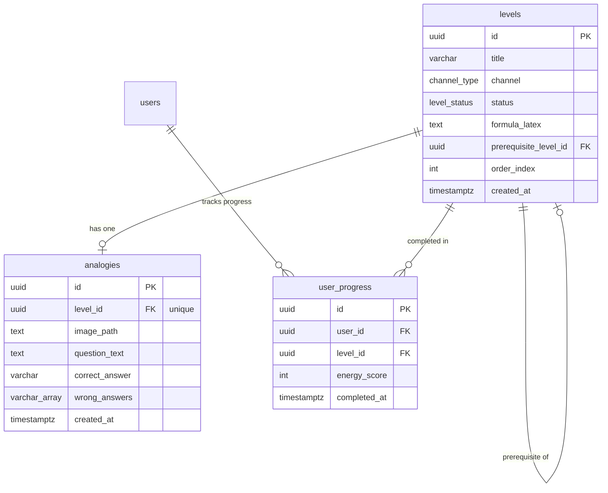

# Data Model: Math Memorization MVP

This document describes the database schema, entity structures, and relationships for the AntiGravity Mathematical Memorization system.

## Database Schema (PostgreSQL DDL)

We use Supabase PostgreSQL to store levels, analogies, and user progress. The schemas enforce high data integrity at the database level.

```sql
-- 1. Create custom ENUM types
CREATE TYPE channel_type AS ENUM ('aritmética', 'álgebra', 'física');
CREATE TYPE level_status AS ENUM ('active', 'locked', 'dx');

-- 2. Levels Table
CREATE TABLE public.levels (
    id UUID PRIMARY KEY DEFAULT gen_random_uuid(),
    title VARCHAR(100) NOT NULL,
    channel channel_type NOT NULL,
    status level_status NOT NULL DEFAULT 'locked',
    formula_latex TEXT NOT NULL,
    prerequisite_level_id UUID REFERENCES public.levels(id) ON DELETE SET NULL,
    order_index INT NOT NULL,
    created_at TIMESTAMPTZ DEFAULT now() NOT NULL,
    
    -- Ensure order indexes are positive
    CONSTRAINT positive_order_index CHECK (order_index >= 0)
);

-- Index for fast retrieval of levels by channel and order
CREATE INDEX idx_levels_channel_order ON public.levels(channel, order_index);

-- 3. Analogies Table (One-to-One with Levels)
CREATE TABLE public.analogies (
    id UUID PRIMARY KEY DEFAULT gen_random_uuid(),
    level_id UUID UNIQUE NOT NULL REFERENCES public.levels(id) ON DELETE CASCADE,
    image_path TEXT NOT NULL, -- Reference to Supabase Storage bucket 'analogy-images'
    question_text TEXT NOT NULL,
    correct_answer VARCHAR(255) NOT NULL,
    wrong_answers VARCHAR(255)[] NOT NULL, -- Array of 3 incorrect answers
    created_at TIMESTAMPTZ DEFAULT now() NOT NULL,
    
    -- Ensure we have exactly 3 wrong answers for multiple choice (4 options total)
    CONSTRAINT check_wrong_answers_count CHECK (array_length(wrong_answers, 1) = 3)
);

-- 4. User Progress Table
CREATE TABLE public.user_progress (
    id UUID PRIMARY KEY DEFAULT gen_random_uuid(),
    user_id UUID NOT NULL REFERENCES auth.users(id) ON DELETE CASCADE,
    level_id UUID NOT NULL REFERENCES public.levels(id) ON DELETE CASCADE,
    completed_at TIMESTAMPTZ DEFAULT now() NOT NULL,
    energy_score INT NOT NULL CHECK (energy_score >= 0 AND energy_score <= 100),
    
    -- User can only have one progress entry per level
    CONSTRAINT unique_user_level_progress UNIQUE (user_id, level_id)
);

-- Index for fetching a user's completed levels quickly
CREATE INDEX idx_user_progress_user ON public.user_progress(user_id);
```

## Entity Relations



## Business Validation Rules

1.  **Level Unlocking Logic**:
    *   A level is considered **unlocked** (visually playable, state "active") for a user if:
        *   Its native status is `'active'` AND `prerequisite_level_id` is `NULL`.
        *   OR the user has a record in `user_progress` where `level_id = prerequisite_level_id`.
    *   If the level's native status is `'locked'` in the database, it remains locked unless unlocked dynamically by progress.
    *   If the level status is `'dx'`, it is rendered transluscently with the dashed border, blocking progress regardless of prerequisites.
2.  **No Punitive Score Reductions**:
    *   `energy_score` starts at `100` at the beginning of a level.
    *   Answering incorrectly in the multiple choice (Fase 3) does not end the session or trigger a red failure screen. Instead, it subtracts a portion of the "Neural Energy" (e.g. -25 per incorrect answer) and prompts the user to try again with a positive encouragement banner, keeping a minimum score of `0`.
